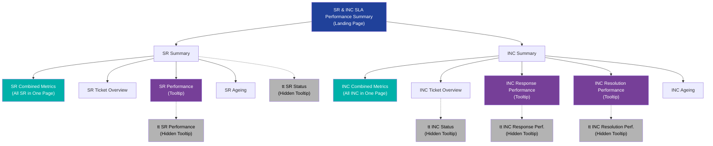
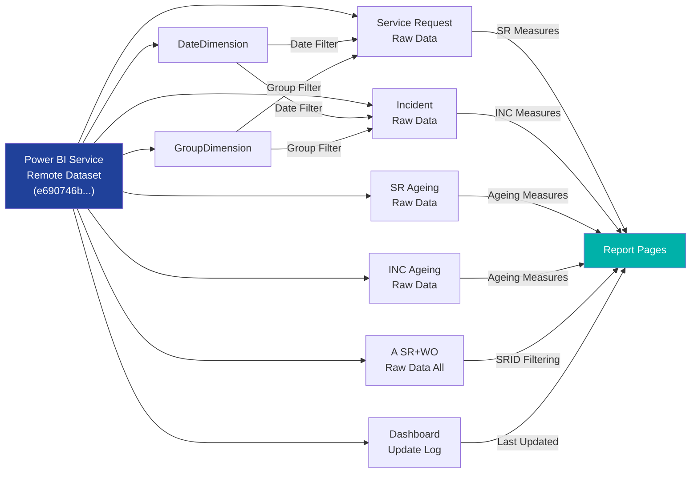

# HCSM Ticket Monitoring Dashboard — Power BI Complete Documentation

> **File:** `HCSM Ticket Monitoring Dashboard.pbix`  
> **Classification:** For Internal Distribution Only (PETRONAS)  
> **Created From:** Cloud (Microsoft Fabric / Power BI Service)  
> **Power BI Version:** 2.152.856.0  
> **Schema Version:** Fabric Report Definition v3.2.0  
> **Date Label Applied:** 2026-06-29  

---

## Table of Contents

1. [Dashboard Overview](#1-dashboard-overview)
2. [PBIX File Architecture](#2-pbix-file-architecture)
3. [Data Model](#3-data-model)
4. [Measures & Calculated Fields](#4-measures--calculated-fields)
5. [Report Pages (17 Total)](#5-report-pages-17-total)
   - [5.1 SR & INC SLA Performance Summary](#51-sr--inc-sla-performance-summary-landing-page)
   - [5.2 SR Summary](#52-sr-summary)
   - [5.3 SR Combined Metrics](#53-sr-combined-metrics)
   - [5.4 SR Ticket Overview](#54-sr-ticket-overview)
   - [5.5 SR Performance (Tooltip)](#55-sr-performance-tooltip)
   - [5.6 SR Ageing](#56-sr-ageing)
   - [5.7 INC Summary](#57-inc-summary)
   - [5.8 INC Combined Metrics](#58-inc-combined-metrics)
   - [5.9 INC Ticket Overview](#59-inc-ticket-overview)
   - [5.10 INC Response Performance (Tooltip)](#510-inc-response-performance-tooltip)
   - [5.11 INC Resolution Performance (Tooltip)](#511-inc-resolution-performance-tooltip)
   - [5.12 INC Ageing](#512-inc-ageing)
   - [5.13–5.17 Hidden Tooltip Pages](#513517-hidden-tooltip-pages)
6. [Color Scheme & Conditional Formatting](#6-color-scheme--conditional-formatting)
7. [Filters & Slicers](#7-filters--slicers)
8. [Visual Interactions](#8-visual-interactions)
9. [Report Settings & Configuration](#9-report-settings--configuration)
10. [Custom Visuals & Resources](#10-custom-visuals--resources)
11. [Data Connection](#11-data-connection)

---

## 1. Dashboard Overview

The **HCSM Ticket Monitoring Dashboard** is a comprehensive Power BI report designed to monitor and track IT Service Management (ITSM) tickets for PETRONAS's **Human Capital Solutions Management (HCSM)** support teams. It covers two primary ticket types:

- **SR (Service Requests)** — Work order-based service requests handled by HCSM support groups
- **INC (Incidents)** — Incident tickets raised for system issues and outages

### Purpose

The dashboard serves as a centralized monitoring tool for:

1. **SLA Performance Tracking** — Monitoring whether response and resolution times meet the 95% SLA target
2. **Ticket Volume Monitoring** — Tracking total ticket counts by status (Initiated, In Progress, Pending, Closed, Cancelled, Resolved)
3. **Ageing Analysis** — Identifying tickets that have been open beyond acceptable timeframes (30+ days, 60+ days)
4. **Assignee Performance** — Breaking down metrics by individual assignees and groups
5. **Trend Analysis** — Visualizing ticket trends over time by month/year

### Support Groups Covered

The dashboard filters by the following HCSM support groups (via `GroupDimension`):

| Group Name |
|---|
| ELEARNING SUPPORT |
| HOSPITALITY SYSTEM SUPPORT |
| MYCAMPUSX SUPPORT |
| MYCAREERX SUPPORT |
| SAP HR |

---

## 2. PBIX File Architecture

The `.pbix` file (6.67 MB) is a ZIP archive containing the following internal structure:

```
HCSM Ticket Monitoring Dashboard.pbix (ZIP)
├── [Content_Types].xml         — MIME type declarations
├── _rels/
│   └── .rels                   — Package relationships
├── docProps/
│   └── custom.xml              — Sensitivity label (For Internal Distribution Only)
├── Connections                 — Remote artifact connection metadata
├── DataModel                   — Binary data model (5.8 MB, Analysis Services tabular model)
├── DiagramLayout               — Model diagram visual layout (UTF-16 encoded)
├── Metadata                    — Version 5, CreatedFrom: Cloud, Release: 2026.03
├── Settings                    — Report-level settings
├── Version                     — Format version identifier
└── Report/
    ├── StaticResources/
    │   ├── RegisteredResources/
    │   │   └── Stacked_Master_WKWW_CMYK*.png    — PETRONAS logo image
    │   └── SharedResources/
    │       └── BaseThemes/
    │           └── CY21SU11.json                 — Base Power BI theme
    └── definition/
        ├── report.json          — Report-level configuration
        ├── version.json         — Report schema version
        └── pages/
            ├── pages.json       — Page ordering and active page
            └── [17 page directories]/
                ├── page.json    — Page metadata (name, size, type, filters)
                └── visuals/
                    └── [visual ID directories]/
                        └── visual.json  — Visual configuration
```

### Key Files Explained

| File | Purpose |
|---|---|
| `Connections` | Links to remote dataset `e690746b-6769-4cbd-8fec-665cdd987f3c` in workspace `81a248dd-b149-45b3-9af2-2f0206f1df7b` |
| `DataModel` | The Analysis Services Tabular model (binary, 5.8 MB) containing all tables, relationships, and DAX measures |
| `DiagramLayout` | Defines the Model View diagram layout with 7 table nodes positioned for visual clarity |
| `report.json` | Global report configuration including theme, global filters, custom visuals, and report settings |
| `pages.json` | Defines the page order (17 pages) and the active page (`INC Resolution Performance`) |

---

## 3. Data Model

### Tables (7 Total)

The data model consists of 7 tables arranged in a star schema pattern:

```
┌─────────────────────────┐     ┌──────────────────────────────────┐
│    DateDimension         │     │  GroupDimension                   │
│  ─────────────────────   │     │  ──────────────────────────────   │
│  Date                    │     │  Group                            │
│  MonthYear               │     └──────────────────────────────────┘
│  Selected Date Range     │              │
│  INC Selected Date Range │              │ (Filter relationship)
└─────────────────────────┘              │
          │                               │
          │ (Date relationships)          │
          ▼                               ▼
┌──────────────────────────────────────────────────────────┐
│              Service Request Raw Data                      │
│  ──────────────────────────────────────────────────────── │
│  Service Request ID, Summary, Detailed Description         │
│  Submit Date, Closed Date, Status, Measurement Status      │
│  Customer Full Name, Customer Organization                 │
│  Product Categorization Tier 3                             │
│  Work Order ID, WO Assignee, WO Assignee Group             │
│  Work Order Status, WO Status Reason, WO Summary           │
│  Work Order Measurement Status, Work Order Detailed Desc   │
│  ──── Measures ────                                        │
│  SR Performance, SR Total Tickets, SR Closed, SR Pending   │
│  SR Initiated, SR Cancelled, SR In Progress                │
│  SR Closed/Met, SR Closed/Missed, SR Status                │
│  Total SR, Closed SR, Cancelled SR, In Progress SR         │
│  Initiated SR, Pending SR, WO Request Assignee             │
└──────────────────────────────────────────────────────────┘

┌──────────────────────────────────────────────────────────┐
│              Incident Raw Data                              │
│  ──────────────────────────────────────────────────────── │
│  Incident ID, Summary, Detailed Description                │
│  Reported Date, Closed Date, Status, Status Reason         │
│  Measurement Status, Priority, Service Target              │
│  Customer Full Name, Customer Organization                 │
│  Assignee, Assignee Group                                  │
│  Product Categorization Tier 3, Service Level Agreement    │
│  ──── Measures ────                                        │
│  INC Total (Non Duplicated), INC Closed, INC Resolved      │
│  INC Assigned, INC Pending, INC In Progress, INC Cancelled │
│  INC Adjusted Response SLA Met %                           │
│  INC Adjusted Resolution SLA Met %                         │
│  INC Response Performance, INC Resolution Performance      │
│  INC Count of ID (Closed/Met/IncidentResponseTime)         │
│  INC Count of ID (Closed/Missed/IncidentResponseTime)      │
│  INC Count of ID (Closed/Met/IncidentResolutionTime)       │
│  INC Count of ID (Closed/Missed/IncidentResolutionTime)    │
│  Total INC (%)                                             │
└──────────────────────────────────────────────────────────┘

┌──────────────────────────────────────────────────────────┐
│        Service Request Ageing Raw Data                      │
│  ──────────────────────────────────────────────────────── │
│  Service Request Ageing Days, Service Request Ageing Range  │
│  Customer Full Name, Customer Organization                  │
│  Product Categorization Tier 3                              │
│  Service Request Submit Date, Detailed Description          │
│  Work Order Assignee, WO Assignee Group, WO ID              │
│  Work Order Status, WO Status Reason, WO Summary            │
│  ──── Measures ────                                         │
│  SR Total Ageing Tickets, SR >30 Days Counts                │
│  SR >60 Days Count                                          │
└──────────────────────────────────────────────────────────┘

┌──────────────────────────────────────────────────────────┐
│           Incident Ageing Raw Data                          │
│  ──────────────────────────────────────────────────────── │
│  Incident ID, Summary, Detailed Description                 │
│  Incident Ageing Days, Incident Ageing Range                │
│  Reported Date, Status, Status Reason                       │
│  Assignee, Assignee Group                                   │
│  Operational Categorization Tier 3                          │
│  Service Level Agreement (SLA)                              │
│  ──── Measures ────                                         │
│  INC Total Ageing Tickets                                   │
└──────────────────────────────────────────────────────────┘

┌──────────────────────────────────────────────────────────┐
│        A  SR + WO - Raw Data All (2)                        │
│  ──────────────────────────────────────────────────────── │
│  SRID (used for filtering/counting)                         │
│  SR Status, WO Request Assignee                             │
│  Cancelled SR, Closed SR, In Progress SR                    │
│  Initiated SR, Pending SR, Total SR                         │
└──────────────────────────────────────────────────────────┘

┌──────────────────────────────────────────────────────────┐
│           Dashboard Update Log                              │
│  ──────────────────────────────────────────────────────── │
│  Last Updated (timestamp of data refresh)                   │
│  Data Source (name of the source system)                     │
└──────────────────────────────────────────────────────────┘
```

### Table Descriptions

| Table | Description |
|---|---|
| **Service Request Raw Data** | Core fact table for all service request tickets with full detail columns and SR-related measures |
| **Incident Raw Data** | Core fact table for all incident tickets with full detail columns and INC-related measures |
| **Service Request Ageing Raw Data** | Subset of open/pending SRs with calculated ageing days and ageing range buckets for ageing analysis |
| **Incident Ageing Raw Data** | Subset of open/pending incidents with calculated ageing days and ageing range buckets |
| **A  SR + WO - Raw Data All (2)** | Unified/combined dataset used for cross-ticket-type counting and filtering (contains SRID for deduplication) |
| **DateDimension** | Date dimension table providing calendar fields (Date, MonthYear) and computed date range selections |
| **GroupDimension** | Dimension table containing the HCSM support group names for filtering |
| **Dashboard Update Log** | Metadata table tracking data freshness (Last Updated timestamp, Data Source name) |

---

## 4. Measures & Calculated Fields

### Service Request (SR) Measures

| Measure | Description |
|---|---|
| `SR Performance` | SLA performance percentage for service requests (Met / Total closed) |
| `SR Total Tickets` | Total count of all service request tickets |
| `SR Closed` | Count of closed service requests |
| `SR Pending` | Count of pending service requests |
| `SR Initiated` | Count of newly initiated service requests |
| `SR Cancelled` | Count of cancelled service requests |
| `SR In Progress` | Count of in-progress service requests |
| `SR Closed/Met` | Count of closed SRs where SLA was met |
| `SR Closed/Missed` | Count of closed SRs where SLA was missed |
| `SR Status` | Service request status text value |
| `SR Total Ageing Tickets` | Total count of ageing (open) SR tickets |
| `SR >30 Days Counts` | Count of SRs open longer than 30 days |
| `SR >60 Days Count` | Count of SRs open longer than 60 days |
| `Total SR` | Grand total of service requests |

### Incident (INC) Measures

| Measure | Description |
|---|---|
| `INC Total (Non Duplicated)` | Deduplicated total count of incident tickets |
| `INC Closed` | Count of closed incidents |
| `INC Resolved` | Count of resolved incidents |
| `INC Assigned` | Count of assigned incidents |
| `INC Pending` | Count of pending incidents |
| `INC In Progress` | Count of in-progress incidents |
| `INC Cancelled` | Count of cancelled incidents |
| `INC Adjusted Response SLA Met %` | SLA percentage for incident response time compliance (adjusted metric) |
| `INC Adjusted Resolution SLA Met %` | SLA percentage for incident resolution time compliance (adjusted metric) |
| `INC Response Performance` | Response time performance rate |
| `INC Resolution Performance` | Resolution time performance rate |
| `INC Count of ID (Closed/Met/IncidentResponseTime)` | Count of incidents where response SLA was met |
| `INC Count of ID (Closed/Missed/IncidentResponseTime)` | Count of incidents where response SLA was missed |
| `INC Count of ID (Closed/Met/IncidentResolutionTime)` | Count of incidents where resolution SLA was met |
| `INC Count of ID (Closed/Missed/IncidentResolutionTime)` | Count of incidents where resolution SLA was missed |
| `INC Total Ageing Tickets` | Total count of ageing (open) incident tickets |
| `Total INC (%)` | Percentage calculation for incident distribution |
| `INC Selected Date Range` | Computed date range text for incident context |

### Dimension Measures

| Measure | Description |
|---|---|
| `Selected Date Range` | Displays the currently selected date filter range as readable text |

---

## 5. Report Pages (17 Total)

The report consists of **17 pages** organized as follows:

| # | Page Name | Type | Visibility | Dimensions (W×H) | Display Mode |
|---|---|---|---|---|---|
| 1 | SR & INC SLA Performance Summary | Regular | Visible | 1350×700 | Fit to Page |
| 2 | SR Summary | Regular | Visible | 1350×1750 | Actual Size |
| 3 | SR Combined Metrics | Regular | Visible | 1350×4100 | Actual Size |
| 4 | SR Ticket Overview | Regular | Visible | 1350×2000 | Actual Size |
| 5 | SR Performance | Tooltip | Visible | 1350×720 | Fit to Page |
| 6 | SR Ageing | Regular | Visible | 1350×930 | Fit to Page |
| 7 | INC Summary | Regular | Visible | 1350×1570 | Actual Size |
| 8 | INC Combined Metrics | Regular | Visible | 1350×4600 | Actual Size |
| 9 | INC Ticket Overview | Regular | Visible | 1350×2050 | Actual Size |
| 10 | INC Response Performance | Tooltip | Visible | 1350×720 | Fit to Page |
| 11 | INC Resolution Performance | Tooltip | Visible | 1350×720 | Fit to Page |
| 12 | INC Ageing | Regular | Visible | 1350×915 | Fit to Page |
| 13 | tt SR Status | Tooltip | **Hidden** | 320×240 | Fit to Page |
| 14 | tt SR Performance | Tooltip | **Hidden** | 320×240 | Actual Size |
| 15 | tt INC Status | Tooltip | **Hidden** | 320×240 | Fit to Page |
| 16 | tt INC Response Performance | Tooltip | **Hidden** | 320×240 | Actual Size |
| 17 | tt INC Resolution Performance | Tooltip | **Hidden** | 320×240 | Actual Size |

> **Note:** Pages prefixed with `tt` are compact tooltip pages (320×240px) designed to appear as hover-over tooltips on visuals in other pages. They are hidden from the report navigation bar.

---

### 5.1 SR & INC SLA Performance Summary (Landing Page)

**Purpose:** The main landing page providing an at-a-glance view of SLA performance across both Service Requests and Incidents.

**Page Size:** 1350 × 700 | **Display:** Fit to Page

#### Layout Structure

The page is divided into two major sections with a header bar:

```
┌──────────────────────────────────────────────────────────────┐
│  [PETRONAS Logo]  SLA PERFORMANCE SUMMARY    Data as of: XX  │
│  [Group Slicer] [Date Slicer]                                │
├──────────────────────────────────────────────────────────────┤
│                                                              │
│  ┌── Service Request ─────────────────────────────────────┐  │
│  │  [SR Performance Card - Large % display]               │  │
│  │  95% SLA Target                                        │  │
│  └────────────────────────────────────────────────────────┘  │
│                                                              │
│  ┌── Incident ────────────────────────────────────────────┐  │
│  │  ┌─ Response Time ──────┐  ┌─ Resolution Time ────────┐│  │
│  │  │  [INC Response SLA   │  │  [INC Resolution SLA     ││  │
│  │  │   Met % Card]        │  │   Met % Card]            ││  │
│  │  │  95% SLA Target      │  │  95% SLA Target          ││  │
│  │  └──────────────────────┘  └──────────────────────────┘│  │
│  └────────────────────────────────────────────────────────┘  │
│                                                              │
└──────────────────────────────────────────────────────────────┘
```

#### Visuals (29 total elements)

| Visual Type | Count | Description |
|---|---|---|
| Card | 4 | SR Performance %, INC Response SLA %, INC Resolution SLA %, Data Update timestamp |
| Slicer | 2 | Group filter (GroupDimension.Group), Date range filter (DateDimension.Date) |
| Shape | 12 | Decorative rectangles/sections for visual grouping |
| Textbox | 8 | Labels: "SLA PERFORMANCE SUMMARY", "Service Request", "Incident", "Response Time", "Resolution Time", "95% SLA Target" (×3), "Data as of" |
| Image | 1 | PETRONAS stacked logo |
| Other | 2 | Unknown container visuals |

#### Key Card Visuals

1. **SR Performance Card**
   - **Measure:** `SR Performance` from `Service Request Raw Data`
   - **Filter:** Filtered on `SRID` count from `A  SR + WO - Raw Data All (2)` 
   - **Font:** Arial, 60pt, Bold
   - **Conditional Formatting:** Green (`#00B1A9`) if ≥ 95%, Red (`#D64550`) if < 95%

2. **INC Adjusted Response SLA Met % Card**
   - **Measure:** `INC Adjusted Response SLA Met %` from `Incident Raw Data`
   - **Font:** Arial, 60pt, Bold
   - **Conditional Formatting:** 
     - Red (`#D64550`) if > 0% AND < 95%
     - Green (`#00B1A9`) if ≥ 95% AND ≤ 100%
   - **Border Radius:** 28px (rounded corners)

3. **INC Adjusted Resolution SLA Met % Card**
   - **Measure:** `INC Adjusted Resolution SLA Met %` from `Incident Raw Data`
   - **Same conditional formatting as Response SLA card**

4. **Data Update Card**
   - **Measures:** `Last Updated`, `Data Source` from `Dashboard Update Log`

---

### 5.2 SR Summary

**Purpose:** Comprehensive summary of Service Request performance, ageing, and status breakdown.

**Page Size:** 1350 × 1750 | **Display:** Actual Size (scrollable)

#### Visuals

| Visual Type | Count | Details |
|---|---|---|
| Card | 12 | SR Performance %, SR Total Tickets, SR Initiated, SR Closed, SR Pending, SR Cancelled, SR In Progress, SR >30 Days, SR >60 Days, SR Total Ageing, Selected Date Range, Data Update |
| Line Chart | 1 | SR Performance & Total Tickets trend over MonthYear |
| Line+Column Combo Chart | 1 | SR Closed/Met vs Closed/Missed (columns) with SR Performance % trend line over MonthYear |
| Column Chart | 1 | SR Total Ageing Tickets by Ageing Range (bucket bars) |
| Slicer | 3 | Group, Date, Customer Organization |
| Shape | ~10 | Section background rectangles |
| Textbox | ~8 | Section headers and labels |
| Image | 1 | PETRONAS logo |

#### Key Charts

1. **SR Performance Trend (Line Chart)**
   - X-Axis: `MonthYear` (from DateDimension)
   - Y-Axis (Line 1): `SR Performance` %
   - Y-Axis (Line 2): `SR Total Tickets` count
   - Shows monthly trend of SLA performance alongside volume

2. **SR Met/Missed Combo Chart**
   - X-Axis: `MonthYear`
   - Columns: `SR Closed/Met` (green) and `SR Closed/Missed` (red)
   - Line: `SR Performance` %
   - Enables visual comparison of met vs missed counts with overall performance trend

3. **SR Ageing Column Chart**
   - X-Axis: `Service Request Ageing Range` (buckets like "0-7 days", "8-14 days", "15-30 days", "31-60 days", ">60 days")
   - Y-Axis: `SR Total Ageing Tickets`

#### Visual Interactions

- The Group slicer (`67f07d9f7aab54fc6569`) has a **NoFilter** interaction with the Customer Organization filter (`794fcdf5363a7d4cea06`), meaning the group selection does not filter the customer organization slicer options.

---

### 5.3 SR Combined Metrics

**Purpose:** A mega-scrollable page combining SR Summary, SR Performance, and SR Ageing metrics into a single comprehensive view.

**Page Size:** 1350 × 4100 | **Display:** Actual Size (long scrollable page)

This page contains all the visuals from:
- SR Summary section (top)
- SR Performance / SLA section (middle)
- SR Ageing section (bottom)

#### Visuals

| Visual Type | Count | Key Data |
|---|---|---|
| Card | ~16 | All SR KPI metrics |
| Line+Column Combo Chart | 1 | SR Met/Missed with Performance trend |
| Line Chart | 1 | SR Performance & Total Tickets trend |
| Column Chart | 1 | SR Ageing by Range |
| Bar Chart | 1 | SR Closed/Met vs Closed/Missed by assignee |
| Pivot Table | 3 | SR by Assignee+Status, Measurement Status, Status summary |
| Table (tableEx) | 2 | Full SR detail table, SR Ageing detail table |
| Slicer | 6 | Group, Date (×2), Customer Organization (×2), Work Order Assignee |
| Textbox/Shape | Many | Section headers, backgrounds |

#### Key Tables

1. **SR Detail Table (tableEx)**
   - Columns: Customer Full Name, Customer Organization, Product Categorization Tier 3, SR Closed Date, SR Submit Date, SR ID, SR Summary, SR Detailed Description, WO Assignee, WO Assignee Group, WO ID, WO Measurement Status, WO Status, WO Status Reason

2. **SR Ageing Detail Table (tableEx)**
   - Columns: Customer Full Name, Customer Organization, Product Cat. Tier 3, SR Ageing Days, Ageing Range, SR Submit Date, SR Detailed Description, WO Assignee, WO Assignee Group, WO ID, WO Status, WO Status Reason, WO Summary

3. **SR by Assignee Pivot Table**
   - Rows: `Work Order Assignee`
   - Values: `SR Closed`, `Service Request Measurement Status`

4. **SR Status Pivot Table**
   - Rows: `Work Order Assignee`, `Work Order ID`
   - Values: `Service Request Status`, `SR Total Tickets`

---

### 5.4 SR Ticket Overview

**Purpose:** Detailed breakdown of service request tickets with status distribution, assignee workload, and categorization analysis.

**Page Size:** 1350 × 2000 | **Display:** Actual Size (scrollable)

#### Visuals

| Visual Type | Count | Details |
|---|---|---|
| Card | 6 | SR Total Tickets, SR Initiated, SR Closed, SR Pending, SR In Progress, SR Cancelled |
| Pie Chart | 1 | SR distribution by Product Categorization Tier 3 |
| Bar Chart | 2 | (1) SR by Assignee with status breakdown, (2) SR by Customer Organization |
| Line Chart | 1 | Monthly trend (SR Closed, Pending, Performance, Total Tickets over MonthYear) |
| Pivot Table | 2 | (1) SR Status by Assignee, (2) SR by Product Cat. Tier 3 |
| Table (tableEx) | 1 | Full SR ticket detail table |
| Slicer | 5 | Group, Date, Work Order Assignee, SR Status, Customer Organization |

#### Key Charts

1. **SR by Assignee (Stacked Bar Chart)**
   - Axis: `Work Order Assignee` / `WO Request Assignee`
   - Values: `SR Initiated`, `SR Closed`, `SR Pending`, `SR In Progress`, `SR Cancelled`
   - Shows workload distribution across assignees

2. **SR by Customer Organization (Stacked Bar Chart)**
   - Axis: `Customer Organization`
   - Values: `SR Initiated`, `SR Closed`, `SR Pending`, `SR In Progress`, `SR Cancelled`, `SR Total Tickets`

3. **SR by Product Category (Pie Chart)**
   - Values: `Service Request ID` (count)
   - Legend: `Product Categorization Tier 3`

---

### 5.5 SR Performance (Tooltip)

**Purpose:** Detailed SLA performance drilldown for Service Requests. Used as a tooltip page triggered from SR cards on other pages.

**Page Size:** 1350 × 720 | **Display:** Fit to Page | **Type:** Tooltip

#### Visuals

| Visual Type | Count | Details |
|---|---|---|
| Card | 4 | SR Performance %, SR Closed/Met count, SR Closed/Missed count, Data Update |
| Line+Column Combo | 1 | Monthly SR Closed/Met vs Missed with Performance trend line |
| Bar Chart | 1 | SR Closed/Met, Closed/Missed, and Performance by category |
| Pivot Table | 1 | SR Closed and SR Total Tickets by Assignee and Measurement Status |
| Table (tableEx) | 1 | Full SR detail with dates, assignee, group, status |
| Slicer | 3 | Group, Date, Work Order Assignee |

---

### 5.6 SR Ageing

**Purpose:** Focused analysis of ageing (long-open) service requests.

**Page Size:** 1350 × 930 | **Display:** Fit to Page

#### Page-Level Filter

This page has a **page-level filter** on `GroupDimension.Group` that restricts data to:
- ELEARNING SUPPORT
- HOSPITALITY SYSTEM SUPPORT
- MYCAMPUSX SUPPORT
- MYCAREERX SUPPORT
- SAP HR

#### Visuals

| Visual Type | Count | Details |
|---|---|---|
| Card | 4 | SR Total Ageing Tickets, SR >30 Days Count, SR >60 Days Count, Data Update |
| Column Chart | 1 | SR Total Ageing Tickets by Ageing Range |
| Pivot Table | 1 | SR >30 Days, >60 Days, Total Ageing by Work Order Assignee |
| Table (tableEx) | 1 | Full ageing SR detail table (13 columns including Ageing Days, Range, WO details) |
| Slicer | 3 | Group, Customer Organization, Work Order Assignee |

#### Key Ageing Table Columns

The main detail table includes:
- Customer Full Name, Customer Organization
- Product Categorization Tier 3
- Service Request Ageing Days, Ageing Range
- SR Submit Date, SR Detailed Description
- Work Order Assignee, WO Assignee Group, WO ID
- Work Order Status, WO Status Reason, WO Summary

---

### 5.7 INC Summary

**Purpose:** Comprehensive summary of Incident ticket performance, volume, and ageing.

**Page Size:** 1350 × 1570 | **Display:** Actual Size (scrollable)

#### Visuals

| Visual Type | Count | Details |
|---|---|---|
| Card | 15 | INC Total, INC Closed, INC Resolved, INC Assigned, INC Pending, INC In Progress, INC Cancelled, INC Response SLA %, INC Resolution SLA %, Response Met/Missed counts, Resolution Met/Missed counts, INC Total Ageing, Selected Date Range, Data Update (×2) |
| Line+Column Combo Chart | 2 | (1) Response: Met vs Missed columns + Performance line, (2) Resolution: Met vs Missed columns + Performance line |
| Line Chart | 1 | INC Total (Non Duplicated) trend over MonthYear |
| Column Chart | 1 | Ageing tickets by Range (shows both INC and SR ageing ranges) |
| Slicer | 3 | Group, Date, Customer Organization |

#### Key Charts

1. **INC Response Performance Combo Chart**
   - X-Axis: `MonthYear`
   - Columns: `INC Count of ID (Closed/Met/IncidentResponseTime)`, `INC Count of ID (Closed/Missed/IncidentResponseTime)`
   - Line: `INC Response Performance`

2. **INC Resolution Performance Combo Chart**
   - X-Axis: `MonthYear`
   - Columns: `INC Count of ID (Closed/Met/IncidentResolutionTime)`, `INC Count of ID (Closed/Missed/IncidentResolutionTime)`
   - Line: `INC Resolution Performance`

3. **INC Volume Trend Line Chart**
   - X-Axis: `MonthYear`
   - Y-Axis: `INC Total (Non Duplicated)`

4. **Ageing Column Chart**
   - X-Axis: `Incident Ageing Range` / `Service Request Ageing Range`
   - Y-Axis: `INC Total Ageing Tickets`

---

### 5.8 INC Combined Metrics

**Purpose:** Mega-scrollable page combining INC Summary, Response Performance, Resolution Performance, INC Ticket Overview, and INC Ageing into one comprehensive view.

**Page Size:** 1350 × 4600 | **Display:** Actual Size (longest page in the report)

#### Visuals

| Visual Type | Count | Key Data |
|---|---|---|
| Card | ~20+ | All INC KPIs (status counts, SLA percentages, ageing counts) |
| Line+Column Combo Chart | 2 | Response Met/Missed + Performance, Resolution Met/Missed + Performance |
| Line Chart | 1 | INC volume trend |
| Bar Chart | 3 | INC by Assignee, by Customer Organization, SLA met/missed breakdown |
| Column Chart | 1 | Ageing by range |
| Pivot Table | 3 | INC by Assignee+Status, by Priority, by Product Category |
| Table (tableEx) | 3 | INC detail table, Response detail, Resolution detail |
| Pie Chart | 1 | INC by Product Categorization Tier 3 |
| Slicer | 5 | Group (×2), Date, Customer Organization, Assignee |

#### Visual Interactions

This page has extensive visual interaction rules:
- **DataFilter interactions:** Certain slicers cascade filter to specific tables
- **NoFilter interactions:** Many visuals are isolated from each other's filter context to prevent unintended cross-filtering (20+ NoFilter rules defined)

---

### 5.9 INC Ticket Overview

**Purpose:** Detailed breakdown of incident tickets with status distribution, assignee analysis, and categorization.

**Page Size:** 1350 × 2050 | **Display:** Actual Size (scrollable)

#### Visuals

| Visual Type | Count | Details |
|---|---|---|
| Card | 7 | INC Total, INC Closed, INC Resolved, INC Assigned, INC Pending, INC In Progress, INC Cancelled |
| Pie Chart | 1 | INC by Product Categorization Tier 3 (with Total INC %) |
| Bar Chart | 2 | (1) INC by Assignee with status breakdown, (2) INC by Customer Organization |
| Line Chart | 1 | INC Total (Non Duplicated) trend over MonthYear |
| Pivot Table | 2 | (1) INC by Product Cat. Tier 3 + Status, (2) INC by Assignee + Status |
| Table (tableEx) | 1 | Full incident detail table (14 columns) |
| Slicer | 5 | Group, Date, Assignee, Status, Customer Organization |

#### Key Charts

1. **INC by Assignee (Stacked Bar Chart)**
   - Axis: `Assignee` / `WO Request Assignee`
   - Values: `INC Assigned`, `INC Closed`, `INC In Progress`, `INC Pending`, `INC Resolved`

2. **INC by Customer Org (Stacked Bar Chart)**
   - Axis: `Customer Organization`
   - Values: Status breakdown counts

3. **INC by Product Category (Pie Chart)**
   - Values: `INC Total (Non Duplicated)`, `Total INC (%)`
   - Legend: `Product Categorization Tier 3`

#### Full Detail Table Columns

| Column | Source |
|---|---|
| Incident ID | Incident Raw Data |
| Summary | Incident Raw Data |
| Detailed Description | Incident Raw Data |
| Reported Date | Incident Raw Data |
| Closed Date | Incident Raw Data |
| Status | Incident Raw Data |
| Status Reason | Incident Raw Data |
| Measurement Status | Incident Raw Data |
| Priority | Incident Raw Data |
| Service Target | Incident Raw Data |
| Customer Full Name | Incident Raw Data |
| Customer Organization | Incident Raw Data |
| Assignee | Incident Raw Data |
| Assignee Group | Incident Raw Data |
| Product Categorization Tier 3 | Incident Raw Data |

---

### 5.10 INC Response Performance (Tooltip)

**Purpose:** Detailed drilldown on incident response time SLA performance. Functions as a full tooltip page.

**Page Size:** 1350 × 720 | **Display:** Fit to Page | **Type:** Tooltip (with page binding)

#### Visuals

| Visual Type | Count | Details |
|---|---|---|
| Card | 4 | INC Response SLA Met %, Met count, Missed count, Data Update |
| Line+Column Combo | 1 | Monthly Response Met vs Missed with Performance line |
| Bar Chart | 1 | Response Met/Missed/Performance breakdown |
| Pivot Table | 1 | INC by Assignee with Met/Missed/Total counts |
| Table (tableEx) | 2 | (1) Met/Missed by Priority, (2) Full incident detail |
| Slicer | 3 | Group, Date, Assignee |

---

### 5.11 INC Resolution Performance (Tooltip)

**Purpose:** Detailed drilldown on incident resolution time SLA performance.

**Page Size:** 1350 × 720 | **Display:** Fit to Page | **Type:** Tooltip (with page binding, active page)

#### Visuals

| Visual Type | Count | Details |
|---|---|---|
| Card | 4 | INC Resolution SLA Met %, Met count, Missed count, Data Update |
| Line+Column Combo | 1 | Monthly Resolution Met vs Missed with Performance line |
| Bar Chart | 1 | Resolution Met/Missed/Performance breakdown |
| Pivot Table | 1 | INC by Assignee with Met/Missed/Total counts |
| Table (tableEx) | 2 | (1) Met/Missed by Priority, (2) Full incident detail |
| Slicer | 3 | Group, Date, Assignee |

---

### 5.12 INC Ageing

**Purpose:** Focused analysis of ageing (long-open) incidents.

**Page Size:** 1350 × 915 | **Display:** Fit to Page

#### Visuals

| Visual Type | Count | Details |
|---|---|---|
| Card | 1 | INC Total Ageing Tickets |
| Column Chart | 1 | Ageing tickets by range (shows both INC and SR ranges) |
| Pivot Table | 1 | Ageing INC by Assignee with Range breakdown and Incident ID |
| Table (tableEx) | 1 | Full ageing incident detail (11 columns) |
| Slicer | 2 | Assignee, Assignee Group |
| Textbox | 6 | "AGEING INCIDENT", "Total Ageing Tickets", "Total Tickets by Ageing Range", "Ageing Incident by Assignee", "Incident Details", "Data as of", "*Please select assigned group" |

#### Ageing Detail Table Columns

| Column | Source |
|---|---|
| Incident ID | Incident Ageing Raw Data |
| Summary | Incident Ageing Raw Data |
| Detailed Description | Incident Ageing Raw Data |
| Incident Ageing Days | Incident Ageing Raw Data |
| Reported Date | Incident Ageing Raw Data |
| Status | Incident Ageing Raw Data |
| Status Reason | Incident Ageing Raw Data |
| Assignee | Incident Ageing Raw Data |
| Assignee Group | Incident Ageing Raw Data |
| Operational Categorization Tier 3 | Incident Ageing Raw Data |
| Service Level Agreement (SLA) | Incident Ageing Raw Data |

---

### 5.13–5.17 Hidden Tooltip Pages

These are compact (320×240px) tooltip pages hidden from the report view navigation. They appear as hover tooltips when users interact with specific visuals on the main pages.

#### tt SR Status (Hidden)

- **Cards:** SR Initiated, SR Closed, SR Pending, SR In Progress, SR Cancelled, SR Total Tickets
- **Purpose:** Quick status count tooltip for SR summary cards

#### tt SR Performance (Hidden)

- **Cards:** SR Performance %, SR Closed/Met, SR Closed/Missed
- **Purpose:** Quick SLA breakdown tooltip for SR performance indicators

#### tt INC Status (Hidden)

- **Background Color:** Theme Data Color 0 (solid, 0% transparency)
- **Cards:** INC Total (Non Duplicated), INC Closed, INC Resolved, INC Assigned, INC Pending, INC In Progress, INC Cancelled
- **Purpose:** Quick status count tooltip for INC summary cards

#### tt INC Response Performance (Hidden)

- **Cards:** INC Response Performance %, Response Met count, Response Missed count
- **Purpose:** Quick response SLA breakdown tooltip

#### tt INC Resolution Performance (Hidden)

- **Cards:** INC Resolution Performance %, Resolution Met count, Resolution Missed count
- **Purpose:** Quick resolution SLA breakdown tooltip

---

## 6. Color Scheme & Conditional Formatting

### Color Palette

The dashboard uses a carefully chosen color palette aligned with PETRONAS branding:

| Color | Hex Code | Usage |
|---|---|---|
| **PETRONAS Teal** | `#00B1A9` | Primary brand color, SLA Met indicators, positive performance |
| **PETRONAS Teal (alt)** | `#00A19C` | Alternative teal shade |
| **Alert Red** | `#D64550` | SLA Missed indicators, critical alerts, underperformance |
| **Warning Yellow/Gold** | `#FDB924` | Warning states, moderate alerts |
| **Lime Green** | `#BFD730` | Positive secondary indicators |
| **Dark Blue** | `#20419A` | Header backgrounds, navigation elements |
| **Royal Blue** | `#12239e` | Secondary blue accents |
| **Purple** | `#6B007B` | Chart series colors |
| **Muted Purple** | `#615E9B` | Chart series colors |
| **Violet** | `#763F98` | Chart series colors |
| **Dark Brown/Charcoal** | `#3D3935` | Text color, dark backgrounds |
| **Light Gray** | `#B3B3B3` | Borders, disabled states |
| **Black** | `#000000` | Text, outlines |
| **White** | `#ffffff` | Backgrounds, card surfaces |

### Conditional Formatting Rules

The SLA performance cards use rules-based conditional formatting:

#### SLA Card Color Rules (95% Threshold)

```
IF value > 0 AND value < 0.95 (95%) THEN:
    Font Color = #D64550 (Red) ← SLA NOT MET
    
IF value >= 0.95 AND value <= 1.0 (100%) THEN:
    Font Color = #00B1A9 (Teal/Green) ← SLA MET
```

This applies to:
- `SR Performance` card
- `INC Adjusted Response SLA Met %` card
- `INC Adjusted Resolution SLA Met %` card

#### Card Visual Styling

| Property | Value |
|---|---|
| Font Family | Arial |
| Font Size | 60pt (main SLA cards) |
| Font Weight | Bold |
| Category Labels | Hidden (`show: false`) |
| Category Label Font | 10pt |
| Border | Hidden |
| Border Radius | 28px (rounded corners) |
| Background | `#00B1A9` teal (hidden by default) |
| Visual Header | Hidden |

---

## 7. Filters & Slicers

### Report-Level Filter

A global report-level filter is applied across all pages:

- **Filter:** `GroupDimension.Group` NOT IN `[null]`
- **Type:** Categorical with inverted selection mode
- **Purpose:** Excludes null/blank group values from all visuals

### Common Slicer Configuration

Most pages share a consistent set of slicers:

| Slicer | Table.Field | Type | Pages Used |
|---|---|---|---|
| **Group** | `GroupDimension.Group` | Dropdown/List | All main pages |
| **Date** | `DateDimension.Date` | Date range picker | All main pages |
| **Work Order Assignee** | `Service Request Raw Data.Work Order Assignee` | Dropdown | SR pages |
| **Assignee** | `Incident Raw Data.Assignee` | Dropdown | INC pages |
| **Customer Organization** | Various tables | Dropdown | SR Ageing, INC pages |
| **Status** | `Incident Raw Data.Status` or `Service Request Raw Data.Service Request Status` | Dropdown | Ticket Overview pages |

### Page-Level Filters

| Page | Filter | Values |
|---|---|---|
| SR Ageing | `GroupDimension.Group` IN | ELEARNING SUPPORT, HOSPITALITY SYSTEM SUPPORT, MYCAMPUSX SUPPORT, MYCAREERX SUPPORT, SAP HR |

### Visual-Level Filters

Many cards have visual-level filters applied:

- **SRID Aggregation Filter:** Several card visuals have a hidden filter on `A  SR + WO - Raw Data All (2).SRID` with aggregation function `CountNonNull` (Function: 5), configured as an advanced filter. This ensures deduplication when counting across the combined dataset.

---

## 8. Visual Interactions

### Cross-Filtering Rules

The report makes extensive use of **visual interaction** controls to manage how slicers and visuals filter each other:

#### SR Summary Page
- Group slicer → Customer Organization slicer: **NoFilter** (selecting a group does NOT filter the customer org dropdown)

#### INC Combined Metrics Page (Most Complex)
Defines 20+ interaction rules including:

| Source Visual | Target Visual | Interaction |
|---|---|---|
| Customer Org slicer | Assignee slicer | **DataFilter** (cascading filter) |
| Various slicers | Card visuals | **NoFilter** (isolated KPIs) |
| Assignee slicer | Multiple tables, cards, pivots | **NoFilter** |
| Status slicer | Various detail tables | **NoFilter** |

**Why NoFilter?** This prevents certain slicers from accidentally filtering KPI cards or summary tables that should always show the full picture for the selected Group/Date.

---

## 9. Report Settings & Configuration

### Report-Level Settings

| Setting | Value | Description |
|---|---|---|
| `useStylableVisualContainerHeader` | `true` | Enables custom styling of visual headers |
| `exportDataMode` | `AllowSummarized` | Users can export summarized data only (not underlying) |
| `defaultDrillFilterOtherVisuals` | `true` | Drilling into a visual filters other visuals on the page |
| `allowChangeFilterTypes` | `true` | Users can change filter types in the filter pane |
| `useEnhancedTooltips` | `true` | Enables modern tooltip experience |

### Slow Data Source Settings

| Setting | Value |
|---|---|
| `isCrossHighlightingDisabled` | `false` |
| `isSlicerSelectionsButtonEnabled` | `false` |
| `isFilterSelectionsButtonEnabled` | `false` |
| `isFieldWellButtonEnabled` | `false` |
| `isApplyAllButtonEnabled` | `false` |

### Model Settings

| Setting | Value |
|---|---|
| `IsRelationshipAutodetectionEnabled` | `false` (manually managed relationships) |
| `TypeDetectionEnabled` | `true` |
| `RelationshipImportEnabled` | `true` |

### Section (Page) Settings

- **Vertical Alignment:** Top
- **Outspace Pane:** Collapsed (expanded = false)

---

## 10. Custom Visuals & Resources

### Custom Visuals

| Visual ID | Name | Description |
|---|---|---|
| `WordCloud1447959067750` | Word Cloud | Public custom visual (registered but usage not confirmed on visible pages) |

### Registered Resources

| Resource | Type | Description |
|---|---|---|
| `Stacked_Master_WKWW_CMYK*.png` | Image | PETRONAS corporate logo used in page headers |

### Theme

- **Base Theme:** `CY21SU11` — Microsoft's default Power BI theme (November 2021 cycle update)
- **Theme Versions:** Visual v1.8.63, Report v2.0.63, Page v1.3.63

---

## 11. Data Connection

### Remote Dataset Connection

The report connects to a **live connection** remote dataset in the Power BI Service:

| Property | Value |
|---|---|
| **Dataset ID** | `e690746b-6769-4cbd-8fec-665cdd987f3c` |
| **Report ID** | `8c1c4cf7-70de-49bd-9ba0-e583a3fc1090` |
| **Workspace Object ID** | `81a248dd-b149-45b3-9af2-2f0206f1df7b` |
| **Connection Version** | 6 |

This means the data model (tables, measures, and relationships) lives in a shared Power BI dataset hosted in the Power BI Service workspace. The `.pbix` file is a **thin report** — it contains the report layer (pages, visuals, filters) but references an external dataset rather than embedding the data locally.

> **Implication:** The `DataModel` file (5.8 MB) inside the .pbix is a cached snapshot of the remote dataset's model. The actual data refreshes happen on the server-side dataset, not within this .pbix file.

---

## Visual Summary Diagram



---

## Data Flow Diagram



---

## Complete Visual Inventory (All Pages)

| Visual Type | Total Count | Description |
|---|---|---|
| **card** | ~80+ | KPI metric displays (counts, percentages) |
| **shape** | ~70+ | Decorative background rectangles for visual grouping |
| **textbox** | ~60+ | Static labels, section headers, annotations |
| **slicer** | ~25+ | Interactive filters (Group, Date, Assignee, Status, etc.) |
| **tableEx** | ~10 | Detailed data tables with full ticket information |
| **pivotTable** | ~10 | Matrix/pivot tables for cross-tabulation |
| **lineStackedColumnComboChart** | 4 | Combo charts (columns + line) for Met/Missed + Performance |
| **lineChart** | 4 | Line charts for trends over time |
| **barChart** | 6 | Horizontal bar charts for category comparisons |
| **columnChart** | 4 | Vertical column charts for ageing ranges |
| **pieChart** | 3 | Pie charts for product category distribution |
| **image** | 5+ | PETRONAS logo placements |
| **Unknown ("")** | ~15 | Container/group visuals (visual grouping elements) |

**Total visual elements across all 17 pages: ~300+**

---

*Documentation generated by analyzing the extracted PBIX archive structure, report definition JSON files, visual configurations, and data model metadata.*
