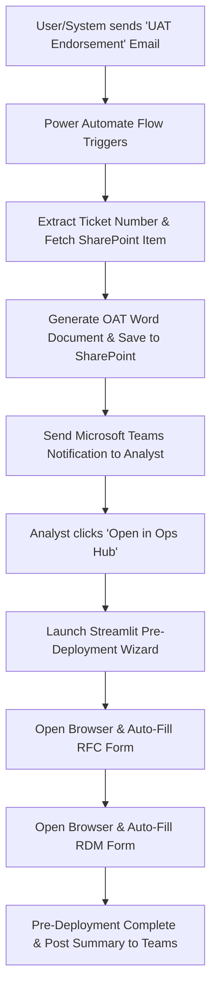
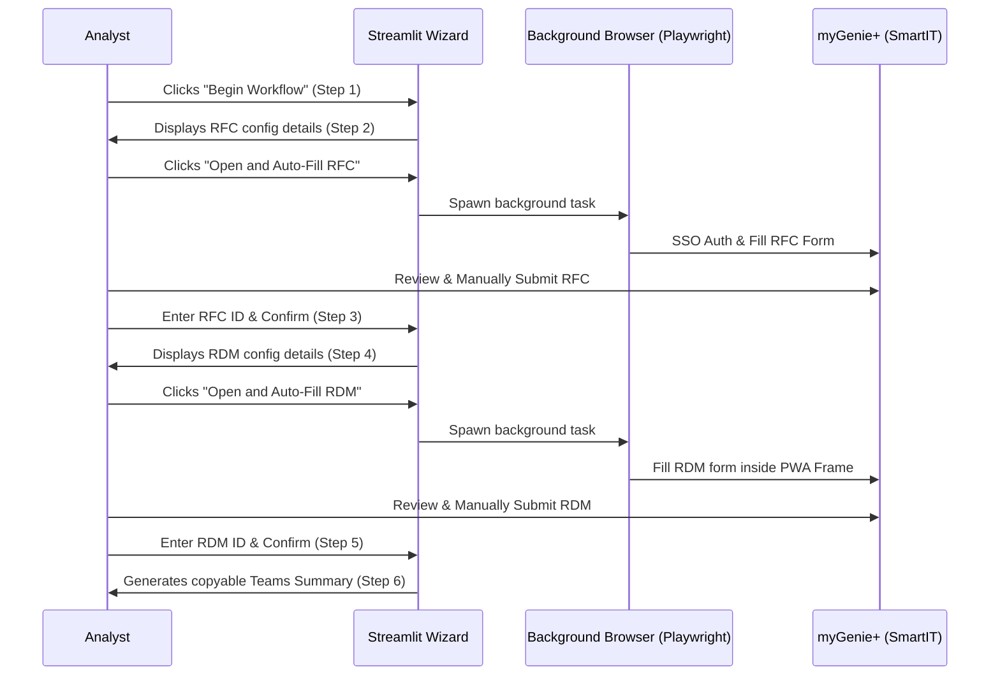

# PETRONAS Pre-Deployment Automation Process

This document details the end-to-end Pre-Deployment Automation process, highlighting the integration between the **Power Automate UAT Approved Flow** and the local **Streamlit Pre-Deployment Manager** application.

---

## 1. Process Overview & Architecture

The pre-deployment process automates the manual effort required to generate Operational Acceptance Testing (OAT) documents and create Infrastructure Change Requests (RFC) and Release Deployments (RDM) in myGenie+.



---

## 2. Power Automate Flow: `Pre-Deployment Automation - UAT Approved`

The flow packages the endorsement, generates the official documentation, and directs the analyst to the Ops Hub with pre-filled context.

### A. Trigger
* **Trigger Event**: `When a new email arrives (V3)`
* **Subject Filter**: `"UAT Endorsement"`
* **Action**: Triggers when the QA tester or business owner sends an endorsement email for a ticket.

### B. Core Execution Steps

1. **Extract Ticket Number** (`Extract_Ticket_Number`):
   * Cleans the email subject (removes forwarding prefixes like `Fw:` or `FW:`) and splits by ` - ` to isolate the myGenie+ ticket identifier (e.g., `ICT_RFC00222811`).
   
2. **Retrieve UAT Details** (`Get_UAT_Online_Item`):
   * Queries the `UAT_Online` SharePoint list at `https://petronas.sharepoint.com/sites/SAPServices/HR/UAT_Online`.
   * Filters the list using the extracted ticket number to retrieve system ID, division, department, analyst, tester, approver, and approval timestamps.
   
3. **Download Signed-off Attachments** (`Get_UAT_Attachments`):
   * Downloads attachments (such as the signed-off UAT script or test evidence) associated with the SharePoint item and builds HTML links for inclusion in the final document.

4. **Generate OAT Document** (`HTML_Template` & `Build_OAT_Document`):
   * Populates a pre-designed HTML document template mimicking the standard PETRONAS OAT format.
   * Replaces placeholders like `{{FunctionalArea}}`, `{{SupportDescription}}`, and `{{AnalystRemarks}}` with data from SharePoint.
   * Renders the HTML template into a Microsoft Word compatible `.doc` file.

5. **Upload OAT to SharePoint** (`Save_OAT_to_SharePoint`):
   * Saves the generated document to:
     `https://petronas.sharepoint.com/sites/SAPServices/HR/UAT_Online/Shared Documents/Pre-Deployment Automation/OAT_ICT_RFC00222811.doc`
   * Retrieves a shareable URL link for the newly uploaded file.

6. **Post Teams Adaptive Card** (`Notify_Analyst_on_Teams`):
   * Posts an interactive card in the HCSM Operations Teams group chat containing:
     * Ticket details (Tester, Approver, Submission/Approval timestamps).
     * **Open OAT Document** button: Opens the generated `.doc` file directly on SharePoint.
     * **Open in Ops Hub** button: Directs the analyst to the local Streamlit application with all ticket parameters encoded as URL query variables:
       ```http
       http://localhost:8501/Pre_Deployment?ticket=ICT_RFC00222811&description=Deploy+changes...&system=myCareerX&analyst=Izwan+Ahmad...
       ```

---

## 3. Streamlit App: `Pre-Deployment Manager`

Once the analyst clicks the **Open in Ops Hub** button from Teams, the local Streamlit wizard guides them through completing the forms in myGenie+ using automated browser control.

### Step-by-Step Wizard Workflow



#### Step 1: Review Workflow & Active Context
* Parses query parameters from the URL (`ticket`, `description`, `system`, `analyst`, `tester`, `approver`, `oat_link`, etc.).
* Establishes the session state.

#### Step 2: Configure RFC (Request for Change)
* Dynamically fills the configuration form based on system mappings (defined in `utils/config.py`).
* Spawns a background browser using Playwright (`utils/browser_launcher.py`) that navigates to the myGenie+ Change Request creation form.
* The script utilizes the user's active SSO credentials, logs in automatically, and fills out the fields (Summary, Impact, Urgency, Risk Level, Change timing, Product/Operational Tier categories).

#### Step 3: Confirm RFC
* The analyst submits the RFC inside the browser.
* The analyst copies the generated RFC ID from myGenie+ and pastes it into the wizard to proceed.

#### Step 4: Configure RDM (Release Deployment Manager)
* Displays pre-configured fields for the RDM form.
* Automatically selects appropriate release configurations based on the prior RFC state (e.g. Release type, priority, and coordination groups).
* Spawns the Playwright task to fill the RDM Progressive View form inside the smart IT iframe structure.

#### Step 5: Confirm RDM
* The analyst submits the Release form in myGenie+ and enters the resulting RDM ID into the wizard.

#### Step 6: Generate Deployment Summary
* Renders a dashboard detailing the successfully created RFC and RDM.
* Provides a copyable summary block formatted for pasting into MS Teams:
  ```text
  🚀 PRE-DEPLOYMENT COMPLETED 🚀
  ===========================================
  TICKET      : ICT_RFC00222811
  SYSTEM      : myCareerX
  ANALYST     : Izwan Ahmad
  RFC NUMBER  : ICT_RFC00222811
  RDM NUMBER  : ICT_RDM00001234
  ===========================================
  ```
